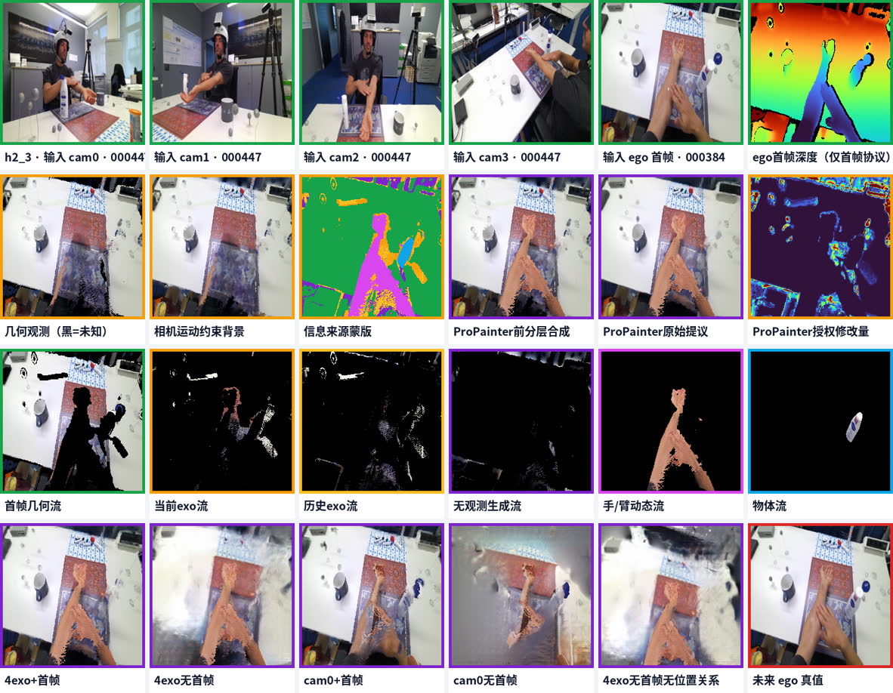

# ExoEgo

Research code for physics-constrained exocentric-to-egocentric video synthesis.
The current implementation targets H2O and separates the prediction into:

1. camera-motion-aware static background transport;
2. metric RGB-D hand/arm observations;
3. rigid object transport with occlusion handling;
4. explicitly authorized video completion for unobserved pixels;
5. a small temporally constrained terminal fusion model.

The central rule is provenance-aware synthesis: measured pixels, transported
pixels, and generated pixels remain separate until the final constrained
composition. Reliable hand/arm and object pixels are hard locked.



## Repository contents

- `h2o_oracle_state/`: H2O synchronization, calibration, geometry, and metadata.
- `h2o_geometric_baseline/`: RGB-D reprojection and multi-view state estimation.
- `h2o_physics_baseline/`: layered rendering, completion masks, ablations, and
  terminal fusion.
- `tools/`: dataset preparation helpers.
- `docs/`: inference contract, hand/object pipeline, results, and research notes.

Raw datasets, processed frames, model weights, third-party repositories, Python
environments, and experiment videos are intentionally excluded.

## Installation

Python 3.11 is recommended.

```bash
python -m venv .venv
source .venv/bin/activate
pip install -r requirements.txt
export PYTHONPATH="$PWD"
```

ProPainter is an optional external dependency used for video completion. Clone
it separately under `third_party/ProPainter` and follow its upstream weight
installation instructions.

## Data layout

Obtain H2O and Ego-Exo4D from their official distributors and respect their
licenses. The default relative layout is:

```text
datasets/
  H2O/
    raw/subject*/.../cam0 ... cam4
    oracle_state/
  EgoExo4D/
models/
  mediapipe/hand_landmarker.task
```

Most entry points expose path arguments; the relative defaults can be replaced
without editing source files.

## Main workflow

```text
H2O preprocessing
  -> multi-view hand/arm/head state
  -> layered geometry render and provenance masks
  -> constrained video completion
  -> temporal terminal fusion
  -> input ablation rendering and evaluation
```

Useful entry points:

```bash
python -m h2o_physics_baseline.smoke_test
python h2o_physics_baseline/render_causal_video_background_split.py --help
python h2o_physics_baseline/compose_propainter_repair.py --help
python h2o_physics_baseline/render_input_ablation_comparison.py --help
python h2o_physics_baseline/evaluate_input_ablation.py --help
```

See [the inference contract](docs/inference_contract.md),
[the hand/object pipeline](docs/hand_object_pipeline.md), and
[the concise results](docs/results.md) before running full experiments.

## Current status

The strongest validated configuration uses four synchronized exocentric RGB-D
views plus the first egocentric RGB-D frame. Reduced-input variants are included
to measure dependence on the first frame, multi-view coverage, and the initial
head-camera relationship. The current code is research-grade and not a
production video generator.

