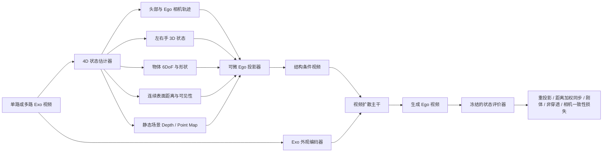

# 物理约束的 Exo-to-Ego 视频生成：文献梳理与研究方向

> 整理日期：2026-09-22  
> 范围：本目录中的 16 篇论文。本文中的“物理约束”特指可观测、可计算的几何与交互约束，例如相机—头部耦合、手—物接触、刚体运动与非穿透；不把一般的时序平滑或视觉真实感等同于物理一致性。

## 1. 结论先行

这个方向值得做，但研究问题需要收窄为：

**从外部视角视频恢复一个跨视角共享的 4D 手—物—相机状态，再用该状态约束第一视角视频生成。**

建议的暂定题目是：

> **PhysicsBridge: Contact- and Camera-Consistent Exocentric-to-Egocentric Video Generation**  
> 面向接触与相机一致性的外部视角到第一视角视频生成

现有工作已经较充分地研究了相机位姿、Plücker 射线、点云渲染、手部布局和跨视角掩码，但尚未看到一条方法同时约束以下四件事：

1. 第一视角相机轨迹与佩戴者头部运动一致；
2. 手与物体的表面距离在两种视角间一致，距离较近时运动保持同步；
3. 被操纵物体满足刚体运动，形状及关键点间距保持稳定；
4. 手和物体不发生明显穿透，近表面时相对速度合理。

这构成了一个明确、可检验的研究空白。它比“给扩散模型加一个泛化的 physics loss”更具体，也比端到端重建完整动态 4D 世界更可执行。

## 2. 文献价值总表

优先级含义：**A** 为直接竞争方法或必须复现的基线；**B** 为关键组件、评价器或重要邻域方法；**C** 为数据集、反向任务或历史背景；**D** 与当前主题关系较弱。

| 优先级 | 论文 | 年份/发表 | 任务与输入输出 | 主要数据集 | 主干与架构 | 跨视角桥梁 | 监督/训练信号 | 已有几何或物理约束 | 主要指标 | 关键局限 | 对本研究的价值与建议用途 |
|---|---|---|---|---|---|---|---|---|---|---|---|
| A | [Put Myself in Your Shoes / Exo2Ego](./2403.06351v1.pdf) | 2024 | 外部视角帧/短视频 → 第一视角图像；先预测 ego 手部布局，再生成图像 | H2O、Aria Pilot、Assembly101 | Transformer 结构转换 + DiT-XL/2 潜空间扩散 | exo RGB/手布局 → ego 2D 手布局 | 配对图像、2D 手部布局、重建式生成监督 | 手部布局提供弱结构约束；无显式 3D、接触或动力学 | FID、SSIM、PSNR、LPIPS、手检测置信度 Feasi | 基本按帧生成；Feasi 只是检测器置信度；几何隐式 | 最基础的 H2O 直接基线；用来证明 3D 物理状态比 2D layout 更有效 |
| A | [Exo2Ego-V](./NeurIPS-2024-exocentric-to-egocentric-video-generation-Paper-Conference.pdf) | NeurIPS 2024 | 四路 360° exo 视频 → ego 视频 | Ego-Exo4D 五类活动、H2O | 文生图 LDM U-Net + 时序注意力；可训练 exo U-Net；AnimateDiff 初始化 | 相对位姿 MLP + PixelNeRF 粗 ego 渲染 + 多尺度特征注意力 | 配对多视角视频，两阶段空间/时间训练 | 明确相机几何和粗视图翻译，无手—物动力学 | 视觉质量和时序生成指标 | 需要四路 exo 与相机标定；没有接触、刚体、非穿透约束 | 多视角强基线；可借鉴粗 ego 几何先验和两阶段训练 |
| A | [EgoExo-Gen](./2504.11732v1.pdf) | ICLR 2025 | exo 视频 + ego 首帧 + 文本 → 未来 ego 视频 | Ego-Exo4D Cooking 33,448 clips；H2O 122 clips 零样本 | SEINE/ConsistI2V 视频扩散 + 跨视角 memory attention + mask encoder | 自动提取手—物掩码，预测 ego HOI mask 再条件生成 | EgoHOS、100DOH、Sapiens、SAM2 伪掩码；配对视频 | 2D HOI mask 约束，未表示深度、接触或物体刚体姿态 | IoU、Contour、Location Error、SSIM、PSNR、LPIPS、FVD | 跨视角 mask IoU 约 20%；复杂手部运动易失败；推理依赖 ego 首帧 | 最接近“交互结构条件”的基线；把其 2D mask 中间层替换为 4D 物理状态 |
| A | [EgoWorld](./2506.17896v2.pdf) | 2025 | 单张 exo 图像 → ego 图像 | H2O 四种泛化划分；TACO、Assembly101、Ego-Exo4D | 单目深度与 3D 手姿态 + Umeyama 变换 + 稀疏点云渲染 + LDM inpainting | exo/ego 3D 手姿态对齐得到显式坐标变换 | 配对图像、手姿态、扩散重建 | 显式 3D 手与点云几何；只有单帧，无接触与动力学 | FID、PSNR、SSIM、LPIPS、PA-MPJPE、CLIPScore | 单图像；尺度/深度误差会传递；未建模物体状态 | 最适合作为“显式可解释状态桥”的起点；扩展到时间和手—物联合状态 |
| A | [EgoX](./2512.08269.pdf) | 2025 | 单路 exo 视频 + 指定 ego 相机轨迹 → ego 视频 | Ego-Exo4D，4,000 clips | Wan 2.1 14B I2V inpainting + LoRA；ViPE 深度；几何引导 self-attention | 静态点云 ego 渲染先验 + ego/exo 3D 射线余弦相似度 attention bias | 配对视频、相机轨迹、扩散去噪 | 可见性、射线和静态场景几何；不约束手—物接触 | PSNR、SSIM、LPIPS、CLIP-I、IoU/Contour/Location、FVD、flicker、smoothness | 需要 ego pose；深度误差敏感；单个 H200 约 10.5 分钟/样本；交互遮挡仍会错 | 单视角直接强基线；复用点云先验与几何 attention，再叠加动态交互状态 |
| A | [Exo2EgoSyn](./2511.20186v2.pdf) | 2026 | 四路 exo 视频 + 相对位姿 → ego 视频 | Ego-Exo4D Bike/Basketball/Covid/CPR | Wan 2.2 I2V；STTransformer 首帧对齐；MultiExoCon；PoseInj；LoRA | 多路 exo latent + dense Plücker rays | 配对四视角视频与相对相机位姿 | 密集相机射线约束；无手—物物理状态 | PSNR、SSIM、LPIPS、用户研究 | 整段姿态注入不能精确控制每帧转头时刻；首帧预测失败会级联 | 最新多视角基础模型基线；研究应突出逐帧相机—头部一致性和交互物理 |
| A | [From Synchrony to Sequence / Syn2Seq-Forcing](./2604.13793.pdf) | 2026 | 单路 exo 到 ego；把两视角间插值成连续过渡序列 | Ego-Exo4D；约 356K 预训练 clips、40K/类微调 | DFoT / U-ViT3D + FiLM camera pose；Wan2.2-Lightning 首尾帧插值 | SO(3) Slerp 与平移插值得到跨视角相机路径 | 配对视频、插值视频与插值姿态 | 相机路径连续，但过渡帧是人为构造；无交互物理 | PSNR、SSIM、LPIPS | 训练成本很高；只报告外观类指标；过渡连续不代表真实物理过程 | 可作为连续视角路径基线；对比“像素插值桥”与“物理状态桥” |
| B | [TrajectoryCrafter](./Yu_TrajectoryCrafter_Redirecting_Camera_Trajectory_for_Monocular_Videos_via_Diffusion_Models_ICCV_2025_paper.pdf) | ICCV 2025 | 单目视频 + 新相机轨迹 → 新轨迹视频 | OpenVid-1M 派生 60K；DL3DV/RealEstate10K 派生 120K；iPhone benchmark | CogVideoX-Fun-5B + 3D VAE + 双流条件 + Ref-DiT | 动态点云渲染控制轨迹；源视频 cross-attention 补外观 | 双重重投影构造动态数据；静态多视图 triplet；两阶段训练 | 很强的相机几何先验，未约束动态物体接触；深度错误会产生穿透等假象 | PSNR、SSIM、LPIPS、VBench | 极大视角变化、单目深度错误与多阶段推理仍困难 | 可直接借鉴“确定性渲染 + 随机补全”的分工；也是几何不足以保证物理的证据 |
| B | [EgoTwin](./2508.13013v1.pdf) | 2025 | 文本 → ego 视频 + 同步人体运动；也支持 motion→video、video→motion | Nymeria，约 170K 个 5 秒 clips | MM-DiT 三分支；CogVideoX 视频分支 + motion VAE；因果跨模态 attention | head-centric 人体表示与视频/运动联合分布 | 文本—视频—Xsens 全身运动三元组；三阶段训练 | 显式头部—相机耦合、手可见性；无外部视角输入和物体接触力学 | I-FID、FVD、CLIP-SIM、M-FID、R-Prec、TransErr、RotErr、HandScore | 不做 exo→ego；DROID-SLAM 评价也有估计误差；缺物体状态 | 直接复用头部—相机一致性表述与 TransErr/RotErr 指标 |
| B | [PlayerOne](./2506.09995v3.pdf) | 2025 | ego 首帧 + 人体动作序列 → ego 世界模拟视频 | EgoExo-4D、Nymeria、FT-HID、EgoExo-Fitness、Egovid-5M | Wan 2.1 1.3B；身体/手/头分离 motion encoders；CUT3R point-map 联合去噪 | 头姿生成旋转相机外参和 Plücker rays | 自动 SMPL-X、SAM2 人体 mask、OpenPose 重投影过滤 | 身体—相机耦合和场景 4D point map；没有显式手—物接触 | 视频质量、动作控制、几何一致性相关指标 | 输入不是 exo 视频；自动动作估计误差；交互物体未独立建模 | 计算量更符合本地原型；借鉴动作分解和训练时 point-map 辅助 |
| B | [WildHands](./2312.06583v2.pdf) | 2024 | 单张 ego RGB + 内参 → 相机坐标系中的绝对 3D 手形、关节与位置 | ARCTIC、AssemblyHands；EPIC/Ego4D 弱监督；H2O/Ego-Exo4D 零样本评估 | ResNet50/HandNet 系列 + KPE 相机位置编码 + MANO/可微渲染 | 视场角位置编码处理 ego 透视畸变 | 实验室 3D；野外 hand mask 和 grasp label 辅助监督 | 显式绝对 3D 手姿态与相机投影 | MPJPE、MRRPE、PA-MPJPE、2D keypoint error | 单帧；只估手，不估物体或接触；遮挡仍难 | 可作为生成结果的手部评价器或伪标签器；证明内参和弱监督很有价值 |
| B | [ObjectRelator](./objectrelator.pdf) | ICCV 2025 | 给一侧视角中的物体 mask/文本，在另一视角分割对应物体 | Ego-Exo4D：1.8M masks、1,335 takes；HANDAL-X | PSALM：Swin-B + Phi-1.5 1.3B + Mask2Former；MCFuse + XObjAlign | 跨视角对象 embedding 对齐与多模态条件融合 | 配对 mask；对象级 alignment loss | 对象身份/可见性一致性；没有 3D 姿态和动力学 | IoU、Location Error、Contour Accuracy、Visibility Accuracy | 对象级对应仍不等于姿态/接触；依赖 query mask | 适合追踪跨视角物体身份、生成物理状态伪标签和做对象级评价 |
| C | [EgoExoLearn](./egoexolearn.pdf) | CVPR 2024 | 异步 exo 示范与 ego 模仿的数据集及跨视角理解基准 | 747 sequences、120 小时；日常与实验室任务；gaze、多层语言和动作标注 | 数据集论文；提供多类视频/语言基线 | 程序步骤、动作语义和 gaze 的异步关联 | 多层动作、细粒度语言、凝视、技能评价标注 | 没有同步几何；强调意图和程序结构 | association、anticipation/planning、segmentation、skill assessment 等 | 不适合像素级配对生成；相机几何不可直接监督 | 后续扩展到异步/跨场景“看示范再生成”的长期方向，不作为第一阶段主数据集 |
| C | [Intention-driven Ego-to-Exo Video Generation / IDE](./2403.09194v2.pdf) | 2024 | ego 视频 + 动作文本 + exo 首帧 → exo 视频，方向与本研究相反 | LEMMA；Seen/Unseen 8:2 划分 | CFPM + trajectory transformation + latent optical-flow DDPM/U-Net | class token 对齐；头部轨迹和文本控制 exo optical flow | 配对视频、动作文本、光流/遮挡图 | 头部轨迹是粗运动条件；无 3D 交互物理 | LPIPS、FVD、KVD | 小头动时 ego/exo 运动对应模糊；128²、24 帧；反向任务 | 可借鉴“意图 + 轨迹”分解；作为反向 cycle consistency 的备选模块 |
| C | [Parallel GAN / P-GAN](./2002.03219v1.pdf) | 2020 | exo 图像 ↔ ego 图像的双向生成 | Exo-Ego Side2Ego、Top2Ego；约 2.7–2.8 万训练对 | 双 U-Net + PatchGAN；共享 encoder 层 | 双向共享特征与 cross-cycle loss | 配对图像；对抗、L1、VGG contextual、cross-cycle loss | 无显式几何或物理 | SSIM、PSNR、Sharpness Difference、KL、识别准确率 | 256² 单帧；老式 GAN；不处理时序、3D 或接触 | 历史基线；可保留其跨视角 cycle 思路，但不值得作为主模型 |
| D | [ConCM](./2506.19558v2.pdf) | ICLR 2026 | 少样本类增量学习 | 与 ego/exo 生成无直接关系 | 一致性约束的增量分类框架 | 无 | 分类监督 | 无 | 增量学习指标 | 任务不相关 | 当前课题不建议投入阅读时间 |

## 3. 数据集如何分工

| 数据集 | 适合阶段 | 可用信息 | 对物理约束的价值 | 主要限制 | 建议用法 |
|---|---|---|---|---|---|
| **H2O** | 第一阶段原型、严格消融、定量评估 | 同步 ego + 多路 exo、手部/物体 3D 信息、动作标签、相机标定 | 能监督手姿态、物体 6DoF、接触与跨视角重投影，是最适合验证“物理状态桥”的数据 | 场景与任务规模有限，域比较受控 | 先做短片段；用真值状态训练/上界实验，再逐步替换为估计状态；设计 unseen action/object/subject/scene 泛化 |
| **Ego-Exo4D** | 第二阶段规模化与真实场景验证 | 大规模同步 ego/exo、多机位、相机轨迹、部分 3D/对象/手部/语言标注 | 能检验复杂场景与跨域泛化，也有对象对应、轨迹和 point cloud 资源 | 全量约 12 TB 以上，标注不均匀，状态伪标签噪声大 | 从 annotations + 选定 cooking 子集 + trajectories 开始；按 UID 精选视频，避免一开始下载全量 |
| **EgoExoLearn** | 后续长期研究 | 异步示范/模仿、gaze、语言、程序步骤、技能标签 | 支持从同步几何转换走向“意图保持的异步转换” | 无逐帧同步和直接几何对应 | 主论文完成后再研究跨场景、跨人的程序级生成 |
| **Nymeria** | 人体—相机先验预训练 | ego 视频、Xsens 全身运动、文本 | 头部—相机耦合与人体运动先验强 | 没有外部视角与交互物体状态 | 若可获得，用于预训练 head/camera consistency evaluator 或 motion branch |
| **EPIC-Kitchens / Ego4D** | 弱监督扩展 | 大量野外 ego 视频，手/物 mask 与 grasp 可伪标 | 训练手部和抓握先验，增强野外鲁棒性 | 无同步 exo 和精确 3D 接触真值 | 只用于预训练评价器/状态估计器，不承担跨视角生成监督 |

## 4. 现有方法覆盖了什么，还缺什么

| 能力 | 代表工作 | 当前成熟度 | 尚未解决的问题 |
|---|---|---|---|
| 2D 手/物结构条件 | Exo2Ego、EgoExo-Gen | 中 | mask/layout 不包含深度、接触法向、对象姿态和遮挡拓扑 |
| 相机位姿与射线控制 | Exo2Ego-V、EgoX、Exo2EgoSyn、TrajectoryCrafter | 较高 | 轨迹正确仍可能出现手穿物、物体形变、接触滑动；逐帧 pose adherence 仍会漂移 |
| 3D 手与点云桥接 | EgoWorld | 单帧较强 | 没有时序状态、物体 6DoF、接触图和速度约束 |
| 人体—相机联合生成 | EgoTwin、PlayerOne | 快速发展 | 没有从 exo 观察中恢复动作，且交互物体缺失 |
| 跨视角对象身份 | ObjectRelator | 可用 | 对象对应不代表对象 3D 姿态或物理状态一致 |
| 手部绝对 3D 评价 | WildHands | 可用 | 遮挡和快速运动仍困难；需要物体/接触联合评价 |
| 视频视觉质量与时序平滑 | 大多数扩散方法 | 较高 | 常用 FVD/LPIPS 无法衡量物理可行性 |

由此得到核心判断：**新意不应放在再设计一种视角编码，而应放在“共享 4D 交互状态的恢复、条件注入和可验证约束”上。**

## 5. 推荐研究问题与假设

### 5.1 研究问题

给定单路或多路同步 exo 视频 \(X^{exo}_{1:T}\)，生成 ego 视频 \(\hat X^{ego}_{1:T}\)。模型先恢复视角无关的动态状态：

\[
S_t = \{C_t, H_t^L, H_t^R, O_t, D_t, P_t\},
\]

其中：

- \(C_t\)：与头部绑定的 ego 相机 SE(3) 状态；
- \(H_t^L,H_t^R\)：左右手的 MANO/3D 关节和速度；
- \(O_t\)：交互物体的类别、mesh/点云与 6DoF；
- \(D_t\)：手指/手掌到物体表面的连续距离场，可平滑转换为运动同步权重；
- \(P_t\)：静态场景点云、深度或 point map。

再把 \(S_{1:T}\) 投影为 ego 条件视频，例如 sparse RGB、depth、normal、hand/object mask、surface-distance heatmap、flow 和 visibility，并以此约束视频扩散模型。离散接触只作为评价阈值，不需要先训练一个接触点分类器。

### 5.2 可证伪的研究假设

1. **状态桥优于像素桥。** 在相同视频生成主干下，显式 3D 手—物—相机状态会比 2D mask、Plücker pose 或纯点云渲染获得更低的接触与重投影误差。
2. **训练时物理约束能提升分布外泛化。** 在 unseen object/action/subject/scene 上，距离加权同步、刚体和非穿透约束会减少视觉指标未能反映的失败。
3. **逐帧状态注入优于整段姿态条件。** 它应改善快速转头和动作关键时刻的对齐，直接回应 Exo2EgoSyn 暴露的 frame-specific pose adherence 问题。
4. **物理评价与视觉评价互补。** FVD/LPIPS 接近的模型，可能在接触持续率、穿透深度和刚体误差上显著不同。

## 6. 建议方法：PhysicsBridge

### 6.1 模块一：4D 物理状态估计器

- **手：** 以 WildHands/HaMeR 类模型得到相机坐标系绝对 3D 手姿，加入时间滤波或时序 Transformer。
- **物体：** ObjectRelator 保持跨视角身份；类别特定时估计 6DoF 与 mesh，类别开放时使用可跟踪点云/关键点。
- **手—物距离：** 直接估计手 mesh/关节到物体表面的连续距离，以 `w(d)=exp(-(d/σ)^2)` 或平滑 sigmoid 得到同步权重；阈值接触只用于报告指标。
- **相机：** 训练时使用标定和头姿；推理时从 exo 人体/头部姿态预测 ego SE(3)。相机必须通过固定或可学习的小变换绑定在头部坐标系。
- **场景：** 单目/多目深度与静态点云提供背景投影；动态手和物体从静态点云中剔除并单独建模。

第一版不必恢复完整可形变 4D 世界。只对**头、两只手和当前被操作物体**建显式状态，背景用 depth/point map 即可。

### 6.2 模块二：确定性投影与生成式补全

借鉴 EgoWorld、EgoX 和 TrajectoryCrafter，将可解释的几何转换与不可见区域生成分开：

1. 用预测 ego 相机把 exo 可见点、手 mesh 和物体 mesh 投影到目标视角；
2. 生成 depth、normal、instance mask、surface-distance heatmap、visibility 和 sparse RGB 条件；
3. 视频扩散模型负责补全遮挡、纹理和未观测背景；
4. exo 外观特征通过 cross-attention 注入，物理状态以逐帧 token、ControlNet 分支或额外 latent channel 注入。

### 6.3 模块三：可计算的物理残差

建议至少实现以下五类损失或采样引导：

| 约束 | 一个可执行的定义 | 解决的失败 |
|---|---|---|
| 相机—头部耦合 | \(L_{cam}=d_{SE(3)}(C_t,T_{head,t}T_{mount})\) | ego 视角与身体动作脱节、转头时刻漂移 |
| 距离加权运动同步 | \(L_{sync}=\sum_{t,j}w(d_{t,j})\lVert v^{hand}_{t,j}-v^{surface}_{t,j}\rVert_{tan}\)，距离越小权重越大 | 手接近物体时两者运动不同步，或出现视觉滑动 |
| 非穿透 | 由物体 SDF 计算手 mesh 顶点的负距离惩罚 | 手指穿过杯子、工具或桌面 |
| 刚体一致性 | 物体 canonical 点对距离在时间上不变；相邻帧由单一 SE(3) 解释 | 物体形变、纹理漂移、不同部位运动不一致 |
| 跨视角重投影/循环 | ego 预测状态重投影回 exo 后与观测 keypoint/mask/flow 对齐 | 生成内容与输入动作或对象身份不一致 |

这些损失不一定直接反传到 RGB 扩散过程。一个更稳定的实现是冻结手/物/相机状态评价器，在预测 \(x_0\) 或低噪声阶段计算辅助损失；也可以先只将残差用于 reranking 或 guidance，降低训练风险。

### 6.4 生成主干选择

第一版建议使用 **Wan 2.1 1.3B、较小的视频扩散模型或已有可训练短视频主干**，冻结大部分参数，只训练 LoRA、物理条件编码器和少量 cross-attention。原因是本机当前未检测到可用 GPU，而 EgoX 的 Wan 14B 级配置依赖 H200，完整复现成本不现实。

推荐 16–24 帧、256² 起步。先证明物理指标和泛化收益，再提高分辨率。论文贡献应落在状态桥和约束，而不是拼算力做最高视觉质量。

## 7. 实验设计

### 7.1 最小可发表版本

**数据：** H2O 为主，Ego-Exo4D Cooking 子集做迁移与泛化。  
**输入：** 先做四路 exo 上界，再做单路 exo；推理阶段不依赖真实 ego 首帧。  
**输出：** 16–24 帧、256² ego 视频。  
**比较对象：** Exo2Ego、Exo2Ego-V、EgoExo-Gen，以及可运行条件下的 EgoX/Exo2EgoSyn；同时做纯视频主干、+pose、+2D mask、+3D state、+physics 的逐步对照。

### 7.2 视觉指标

- 帧级：LPIPS、SSIM、PSNR；有必要时报告 DINO/CLIP 特征相似度。
- 视频级：FVD、temporal flicker、motion smoothness。
- 对象级：mask IoU、Location Error、Contour Accuracy、Visibility Accuracy。

### 7.3 必须新增的物理指标

| 指标 | 计算建议 | 方向 |
|---|---|---|
| Hand MPJPE / PA-MPJPE | 用冻结的 3D hand estimator 从生成视频恢复姿态，与真值或重投影状态比较 | 越低越好 |
| Object pose error | ADD(-S)、旋转角误差、平移误差 | 越低越好 |
| Contact F1 | 生成视频恢复的接触集合与真值接触集合比较 | 越高越好 |
| Contact persistence | 真值接触区间内，预测接触连续帧占比 | 越高越好 |
| Penetration depth/rate | 手 mesh 顶点进入物体 SDF 的深度与比例 | 越低越好 |
| Rigid consistency | 物体跟踪点间距方差，或最佳刚体 SE(3) 后的残差 | 越低越好 |
| Distance-weighted relative velocity | 按连续表面距离加权的手点—物体表面切向/法向相对速度 | 越低越好 |
| Camera-head TransErr / RotErr | 采用 EgoTwin 的轨迹对齐后误差 | 越低越好 |
| Cross-view reprojection error | 生成 ego 状态映射回 exo 后的 keypoint/mask/flow 误差 | 越低越好 |

评价器必须先在真实视频上校准：报告真实视频的噪声下限，并证明指标能够区分人工注入的穿透、滑移、相机错位和刚体形变。否则“physics metric”可能只是另一个有偏的视觉模型分数。

### 7.4 核心消融

1. 2D mask vs. 3D hand only vs. 3D hand + object pose vs. 完整 contact graph；
2. 仅条件注入 vs. 加物理 loss vs. 采样期 physics guidance；
3. 整段 pose embedding vs. 逐帧 pose token；
4. 无点云、静态点云、静态背景 + 动态手物分层点云；
5. 使用真值状态、部分真值状态、完全估计状态，量化状态估计误差的上限和传播；
6. 单 exo 视角、最佳 exo 视角、四 exo 视角；
7. seen 与 unseen action/object/subject/scene；
8. 视觉最优 checkpoint 与物理最优 checkpoint 的 Pareto 曲线。

## 8. 分阶段实施路线

### 阶段 0：数据和评价器

- 完成 H2O 下载、校验、划分解析和最小 clip loader；
- 可视化一段 exo/ego 同步视频、相机、3D hand、object pose；
- 在真实 H2O ego 视频上跑手部、物体、距离/同步、相机评价器，测量误差下限；
- 人工扰动真值状态，验证每个物理指标对对应错误单调敏感。

### 阶段 1：不训练视频模型的状态桥

- 从 exo 真值状态投影出 ego depth/mask/surface-distance/flow；
- 比较真值 ego 与投影，确认坐标系、尺度和时序完全正确；
- 再用估计的 exo 状态替代真值，画出误差分解。

> 执行状态（2026-09-25）：Oracle State 解析、世界坐标统一、逐关节表面距离和纯几何审计已经完成，共处理 184 个序列、114,329 个可用状态帧，并建立 3,301 个 64 帧训练窗口（train/val/test = 1,575/833/893）和 1,300 个动作片段。训练归一化统计仅由 subject1/2 计算；八类物体各完成 20,000 点表面采样与 mesh 审计。初版以连续距离作为训练信号，双阈值接触与切向滑移只用于评价，不训练接触点分类器。`subject1/h1/0/cam3` 的内外参已提取：相机中心世界坐标为 `[-0.624223, 0.058057, -0.155498] m`，3D 手和物体重投影已与 RGB 对齐。三段 2560×1440 四栏视频使用相同 cam3 投影视角，并以 42×T 热力图展示连续距离。四个 subject 的 cam0–cam4 RGB 已全部下载、解压并通过归档大小检查，因此可以直接开展五视角批量重投影校验。实现与结果见 `h2o_oracle_state/STEP1_REPORT.md`。

> 五视角更新（2026-09-25）：已对全部 184 个序列的 cam0–cam4 按每秒一帧抽样，覆盖 20,365 个“帧×相机”组合。920 个序列—相机条目的 RGB/depth/pose 数量及 1280×720 分辨率全部一致；跨视角手投影 P95 的最大值为 `1.0433e-7 px`，物体平移 P95 最大值为 `1.2624e-10 m`。已把 3,301 个状态窗口展开为 13,204 个 cam0–cam3→cam4 配对样本，并生成 3840×1440 五视角人工检查图。Ego-Exo4D 方面已筛出 556 个 geometry-ready Cooking takes，固定 24-take/2.05 h pilot，并完成 216 个 448p ego/exo 视频（3.48 GiB）和 120 个 trajectory 文件（4.42 GiB）的下载与校验。

这一阶段最关键。若状态桥本身不成立，直接训练扩散模型只会把错误藏在视觉质量里。

#### 3D/4D 状态的三级获取路线

这里的“4D”先定义为低维 3D 状态随时间形成的序列，不要求一开始重建完整 dynamic NeRF、4D Gaussian 或可形变世界。只显式描述头部/相机、双手、一个活动刚体和连续手—物距离，背景用静态 depth/point map 表示。

| 层级 | 状态来源 | 具体做法 | 要回答的问题 |
|---|---|---|---|
| **Level 1: Oracle State** | H2O 的相机标定、3D 手姿态、物体 pose/模型和同步 ego/exo | 将所有标注统一到世界坐标系；按帧形成手与物体轨迹；计算逐关节/手表面距离并投影到 ego，得到 depth、normal、mask、flow、distance map | 正确 4D 状态本身是否比 2D mask/pose 更能约束生成？这是继续研究的先决实验 |
| **Level 2: Multi-view Reconstruction** | 只使用多路同步 exo RGB、内外参和可获得的 2D 检测 | 多视角手关键点三角化并拟合 MANO；物体通过跨视角 mask/关键点、PnP 和可微轮廓渲染估计 6DoF；用时序 SE(3)、骨长、刚体和重投影约束联合优化 | 在不读取目标 ego 状态和人工 3D 真值时，能否恢复足够准确的交互状态？ |
| **Level 3: Single-view Student** | 单路 exo RGB | 用 Level 2 的高置信度多视角结果作为教师；学生预测手、物体、表面距离和头部/相机状态，并加入单视角重投影、时序、骨长和刚体先验 | 最终实用设置能否只用单路 exo，并保持物理收益？ |

推荐严格保留三套实验结果：

\[
\text{Oracle State}\rightarrow\text{Multi-view Reconstructed State}\rightarrow\text{Single-view Estimated State}.
\]

这样可以把误差明确归因于视频生成器、多视角 3D 恢复或单视角歧义，避免所有模块端到端训练后无法判断失败来源。

多视角重建的最小实现顺序是：

1. **坐标校验：** 将 H2O 真值手关键点、物体 mesh 投影到五个相机，逐帧检查像素误差、左右手身份、单位和时间同步；
2. **手部替换：** 各 exo 视角做 2D 手关键点检测，多视角三角化，再以重投影、骨长、关节角和时间平滑拟合 MANO；
3. **物体替换：** 用跨视角 mask 保持对象身份，以 PnP/可微渲染估计每帧 pose，再用单一 SE(3) 轨迹和刚体残差优化；
4. **距离与同步：** 根据手 mesh 到物体表面的距离生成连续权重，距离近时约束切向相对速度；阈值与连续帧过滤只用于评价；
5. **相机替换：** 训练时真实 ego pose 只作教师；推理时由 exo 头部 3D pose 预测 ego camera SE(3)，学习一个固定或弱可变的 head-to-camera mount transform；
6. **置信度管理：** 使用可见视角数、三角化条件数、重投影误差、跟踪稳定性和时间残差给每帧状态加权；低置信度帧不作为硬真值。

在整个过程中，真实 ego 图像和状态只能用于训练教师、生成监督与评价，最终推理路径必须保持 `exo video → estimated state → ego video`，避免把目标视角信息泄漏到输入。

### 阶段 2：短视频生成 MVP

- 以冻结视频主干 + LoRA/Control 分支训练；
- 先做 `pose + depth + hand/object mask`；
- 再加入 `surface-distance heatmap + state tokens`；
- 最后加入非穿透、低滑移、刚体和重投影约束。

### 阶段 3：Ego-Exo4D 泛化

- 只下载 annotations、选定 Cooking clips、camera trajectories 和必要 point cloud；
- 用 H2O 学到的状态/约束模块生成伪标签；
- 使用置信度过滤和 weak supervision 微调；
- 报告 H2O→Ego-Exo4D 零样本与少量微调结果。

### 阶段 4：可选扩展

- 从同步转换扩展到 EgoExoLearn 异步示范：在物理状态之上增加 action/intention token；
- 生成多种合理 ego 轨迹，研究同一 exo 观察对应的多解性；
- 将生成结果用于 ego action recognition、anticipation 或机器人模仿学习，验证下游价值。

## 9. 主要风险和收缩策略

| 风险 | 影响 | 收缩策略 |
|---|---|---|
| 估计状态噪声大 | 物理条件反而误导生成 | 先做真值上界；按置信度门控；训练时做状态扰动增强；报告 oracle/estimated 两套结果 |
| 接触阈值不稳定 | 单一 Contact F1 难复现 | 训练使用连续表面距离；离散评价报告多阈值曲线、法向和持续帧数 |
| 物理 loss 破坏视觉质量 | 图像僵硬或模糊 | 辅助 loss 延后启用；在低噪声阶段计算；先用 reranking/guidance；报告 Pareto 曲线 |
| 物体 mesh 不完整 | SDF 非穿透不可用 | 第一版限制 H2O 已知类别；开放类别改用可跟踪点云和局部表面距离 |
| 大模型训练资源不足 | 无法复现 14B/H200 工作 | 用 1.3B 级主干、短片段、低分辨率、LoRA；把贡献集中在可插拔状态桥和评价协议 |
| 研究范围过大 | 同时做重建、生成、物理和泛化会失控 | 主论文只显式建模头、手和一个活动物体；背景保持静态几何；复杂多物体与可形变物体放后续 |

## 10. 最终建议

建议按以下顺序推进：

1. **先在 H2O 做“物理评价协议 + 真值状态投影”**，一到两周内判断坐标、接触和刚体信号是否足够可靠。
2. **再做一个小主干的条件生成基线**，只比较 pose、2D mask 和 3D state，验证“状态桥优于像素桥”。
3. **把 distance-weighted synchrony、non-penetration、rigid consistency 和 camera-head coupling 逐项加入**，每项都要有独立可视化和消融。
4. **最后转到 Ego-Exo4D Cooking 子集**，证明方法能在状态伪标签有噪声时工作。

最有价值的论文主张不是“生成得更清晰”，而是：

> **在相近视觉质量下，显式的跨视角 4D 交互状态能够显著降低近表面运动不同步、物体形变、穿透和相机错位，并改善未见动作、物体、人物和场景上的泛化。**

只要 H2O 上的 oracle-state 实验首先证实这条主张，这个方向就值得继续；如果 oracle state 也不能改善这些物理指标，应该尽早收缩或改题，而不是继续扩大模型。

## 11. 推荐阅读顺序

1. **EgoX → Exo2EgoSyn → Syn2Seq-Forcing：** 掌握最新直接生成路线与相机几何控制边界。
2. **EgoExo-Gen → EgoWorld → Exo2Ego：** 理解从 2D hand/mask 到显式 3D 手桥接的演化。
3. **TrajectoryCrafter：** 学习“几何渲染负责控制，扩散模型负责补全”的工程分工。
4. **EgoTwin → PlayerOne：** 提取头部—相机耦合、动作分解和联合状态生成方法。
5. **WildHands → ObjectRelator：** 搭建手与对象状态估计/评价工具链。
6. **Exo2Ego-V：** 作为多视角经典基线补全。
7. **EgoExoLearn、IDE、P-GAN：** 只在扩展到意图、异步动作或撰写相关工作时精读。
8. **ConCM：** 当前可跳过。
